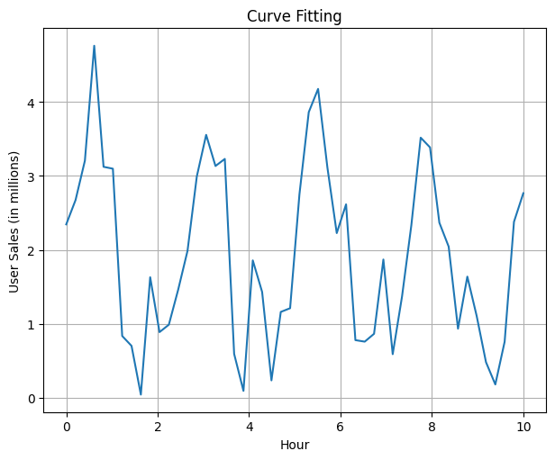
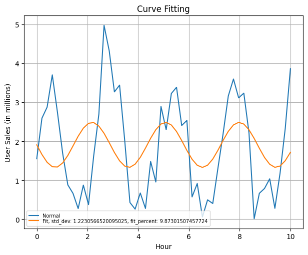

# Exploring the math of thresholds

Article Link:

## Simulations

### The Law of Large Numbers

#### 10 instances

#### 20 instances

#### 100 instances

#### 150 instances

#### 200 instances

#### 250 instances

### Curve Fitting

#### Default observation

#### With Unfit

#### With Fit

#### With Fit Difference

